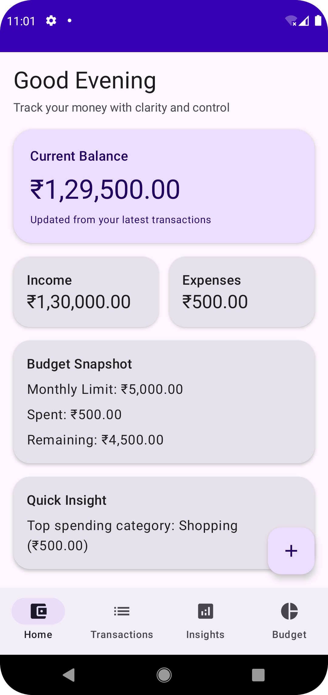
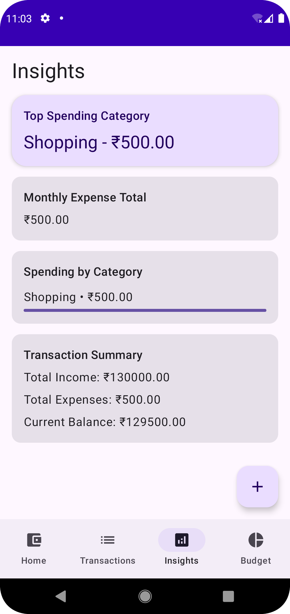
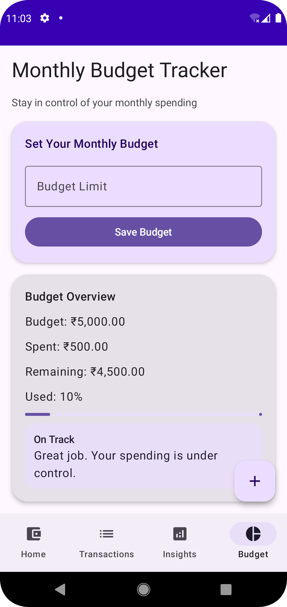

💰 Finance Companion App

A modern Android finance management application built using Kotlin and Jetpack Compose, designed to help users track income, manage expenses, set budgets, and gain meaningful financial insights.

🚀 Features

📊 Dashboard (Home)
- View current balance
- Income vs Expense summary
- Budget snapshot
- Quick insights (top spending category)
- Recent transactions preview

💸 Transactions
- Add income and expense entries
- Categorize transactions (Food, Shopping, etc.)
- Search transactions
- Filter transactions by type
- Clean list view with reusable UI components

🎯 Budget Management
- Set monthly budget limit
- Track spending vs budget
- Real-time remaining balance calculation

📈 Insights
- Total income and expense summary
- Spending by category
- Top spending category detection
- Visual indicators (progress bars)

🧠 Tech Stack

- Language: Kotlin
- UI: Jetpack Compose (Material 3)
- Architecture: MVVM (Model-View-ViewModel)
- Database: Room (SQLite)
- State Management: StateFlow / Compose State
- Navigation: Navigation Compose

🏗️ Project Structure

com.example.financecompanion
├── data
│ ├── local (Room DB, DAO, Entities)
│ └── repository
│
├── model (Data classes, enums)
│
├── ui
│ ├── screens (Home, Transactions, Budget, Insights)
│ ├── components (Reusable UI)
│ ├── navigation
│ └── theme
│
├── viewmodel (State & business logic)
│
└── MainActivity.kt

⚙️ How to Run

1. Clone the repository
2. Open in Android Studio
3. Sync Gradle
4. Run on emulator or device

🧪 Testing Checklist

- Add income and expense
- Verify balance updates
- Test budget limit and remaining amount
- Search transactions
- Apply filters
- Check insights calculations

🧪 Testing Checklist

- Add income and expense
- Verify balance updates
- Test budget limit and remaining amount
- Search transactions
- Apply filters
- Check insights calculations

📌 Key Implementation Highlights

- MVVM architecture implementation
- Room database for local storage
- State management using ViewModel + Compose state
- Reusable UI components
- Clean and scalable code structure

📖 Assumptions

- Data is stored locally (no backend)
- Single-user application
- Focus on functionality over production-level deployment

🔮 Future Improvements

- Firebase / API integration
- Authentication system
- Charts and analytics
- Notifications and reminders

👨‍💻 Author

Ishita Shukla

📸 Screenshots

🏠 Home Screen

💰 Transactions Screen

📊 Insights Screen

📅 Budget Screen

